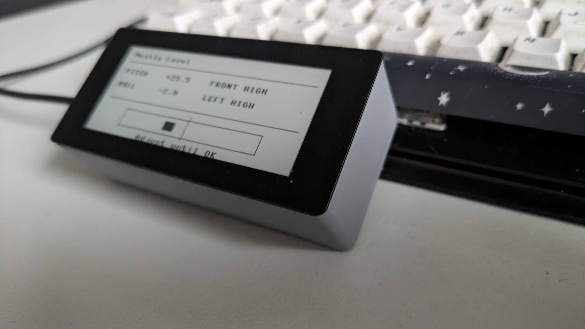
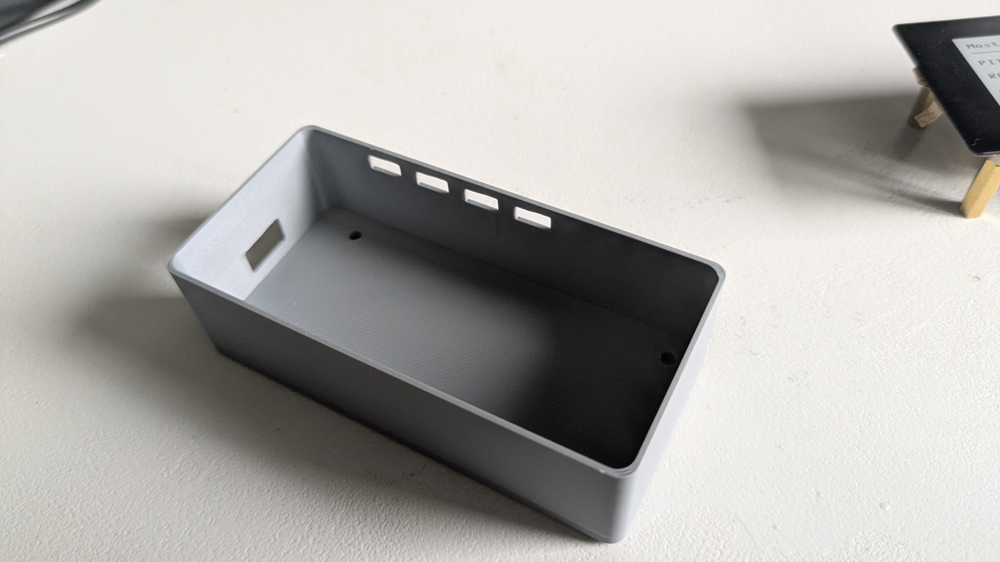

# Mostly Level

A tiny digital leveling tool built with a Raspberry Pi Pico WH, MPU6050, and a Waveshare 2.9" e-paper display.

Mostly Level reads accelerometer data from the MPU6050, calculates pitch and roll, applies smoothing + calibration offsets, and displays leveling guidance on the screen.

The project started as an experiment with e-paper displays and evolved into a compact handheld digital level.

---

# Gallery





---

# Features

* Pitch + roll measurement
* MPU6050 accelerometer integration
* Persistent calibration storage
* Smoothed sensor readings
* On-device calibration button
* E-paper UI with leveling guidance
* Automatic boot via `main.py`
* Recovery handling for failed MPU reads

Current leveling guidance:

* FRONT HIGH
* REAR HIGH
* LEFT HIGH
* RIGHT HIGH
* LEVEL

---

# Current State

The project is currently running on a Waveshare 2.9" e-paper display.

The software is stable and working, but the display technology has some limitations for real-time bubble-level style interfaces:

* e-paper refreshes slowly
* full refreshes flash black/white
* frequent updates cause flicker
* partial refresh support is limited in MicroPython

Because of this, the firmware now refreshes the display only occasionally and only when values change meaningfully.

The next planned hardware iteration will likely switch to a 2.8" SPI TFT IPS display for smoother real-time motion.

---

# Hardware

## Main Components

* Raspberry Pi Pico WH
* MPU6050 accelerometer / gyroscope
* Waveshare Pico-CapTouch-ePaper-2.9
* Onboard Waveshare button

---

# Wiring

## MPU6050

| MPU6050 | Pico |
| ------- | ---- |
| VCC     | 3V3  |
| GND     | GND  |
| SDA     | GP4  |
| SCL     | GP5  |

## Calibration Button

Using the Waveshare onboard button:

| Function           | Pico Pin |
| ------------------ | -------- |
| Calibration Button | GP2      |

The button uses the Pico internal pull-up resistor.

---

# Software Structure

```text
main.py            # Main application loop
display.py         # Waveshare e-paper driver
calibration.json   # Stored calibration offsets
```

---

# Installation

## 1. Flash MicroPython

Install the RP2040 MicroPython firmware:

[https://micropython.org/download/rp2-pico-w/](https://micropython.org/download/rp2-pico-w/)

---

## 2. Upload Files

Using Thonny, upload the following files directly to the Pico:

```text
main.py
display.py
```

Important:

`main.py` must be saved on the Pico filesystem itself.
Otherwise the application will only run when manually started from Thonny.

---

## 3. Run

The application starts automatically on boot:

```text
main.py
```

You can also manually run it from Thonny.

---

# Calibration

1. Place the device in the desired “level” position
2. Press the calibration button
3. Keep the sensor still during calibration
4. The current pitch + roll become the new zero reference
5. Calibration is stored in:

```text
calibration.json
```

Calibration survives reboots.

---

# Display Refresh Notes

E-paper displays are not designed for continuous animation.

To reduce:

* flickering
* ghosting
* excessive refresh flashing
* panel wear

…the firmware:

* refreshes slowly
* only refreshes when values change
* smooths sensor readings before updating

This makes the display much more usable while still preserving the low-power benefits of e-paper.

---

# Known Working Configuration

## Board

* Raspberry Pi Pico WH
* MicroPython RP2040 build

## Sensor

* MPU6050

## Display

* Waveshare Pico-CapTouch-ePaper-2.9

Important display fix:

```python
self.send_command(0x21)
self.send_data(0x00)
self.send_data(0x80)
```

Without this fix, the display may show a noisy border band.

---

# Planned Improvements

## Hardware

* 2.8" SPI TFT IPS display
* Battery support
* USB-C power
* Enclosure design

## Software

* Better graphical UI
* Smooth bubble-level visualization
* Partial refresh experiments
* Auto-rotation
* Touch support
* Deep sleep mode
* Wi-Fi logging
* Web dashboard
* Calibration profiles

---

# Why “Mostly Level”?

Because perfectly level is overrated.

---

# License

MIT
